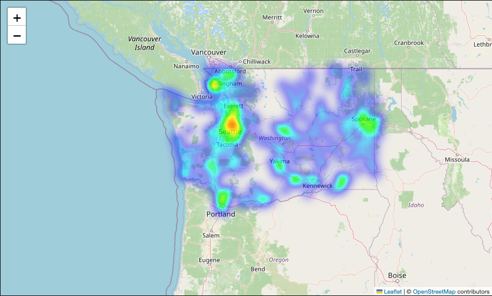
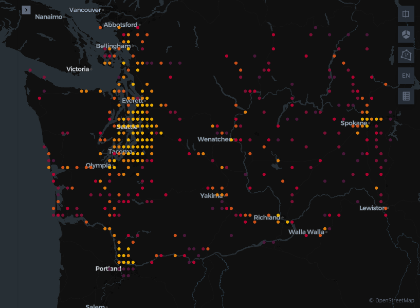

# Eletric Vehicle Charging Demand Estimator

This project estimates the public EV charging demand across different regions in Washington State using regression and classification models. It involves preprocessing raw EV registration data, training ML models, and deploying an interactive Streamlit application.

---

## Project Overview
**Goal:** Predict electric vehicle demand using regression (EV count) and classification (charging demand level).
**Data Source:** Washington State EV Registration Dataset
**Tech Stack:** Python, pandas, scikit-learn, Streamlit, SHAP, Folium, Kepler.gl

---

## Data Preprocessing
Raw dataset columns included vehicle model details, city, postal code, base MSRP, range, and fuel type. We performed the following:

**Cleaning & Feature Engineering**
1. Filtered for electric vehicles only
2. Standardized numeric features:
  - avg_electric_range
  - bev_ratio (ratio of battery electric vehicles)
  - avg_base_msrp
3. Calculated regional aggregates per ZIP code
4. Mapped ZIP codes to geographic coordinates (latitude & longitude)

**Data Visualizations (Exploration)**
1. Top 20 cities by number of EVs
2. Feature impact on regression model using SHAP
3. Heatmap of EV concentration in Washington using Folium

4. Interactive EV density map using Kepler.gl

---

## Model Training
1. **Regression Model**
  - Target: `ev_count` (number of EVs in ZIP code)
  - Algorithms: Linear, Ridge, Lasso, Random Forest, XGBoost
  - Features: Standardized numeric inputs + latitude, longitude

2. **Classification Model**
  - Target: `demand_level` (High, Medium, Low)
  - Algorithms: Logistic, KNearest Neighbors, Decision Tree, Random Forest, XGBoost

3. **Model Performance**
  - MAE, RMSE for regression
  - Accuracy, F1-Score for classification

---

## Streamlit App
**Key Features**
- Toggle between Regression and Classification mode
- User inputs via sliders/dropdowns:
  - ZIP Code
  - Avg Electric Range (mi)
  - BEV Ratio (0-1)
  - Avg Base MSRP ($)
- Automatic latitude/longitude lookup from ZIP code
- Model output:
  - EV Count (Regression)
  - Demand Level (Classification)

- Display raw and standardized inputs for transparency

**How It Works**
1. User selects a ZIP code and adjusts input features.
2. The app retrieves geolocation (lat/lon) for that ZIP.
3. Inputs are standardized using training stats.
4. Prediction is made using the loaded .pkl model.
5. Output is shown with both input data and prediction.

---

## Results & Insights
- ZIP codes with higher EV counts are concentrated around Seattle, Bellevue, and Redmond
- MSRP and BEV Ratio strongly influence EV population
- Location (latitude, longitude) is critical in determining demand

---

## Future Work
- Incorporate external charging station data for validation
- Add temporal analysis based on vehicle registration dates
- Deploy the model to cloud (e.g., Streamlit Community Cloud)

---

## References
1. [Washington State EV Data](https://data.wa.gov/Transportation/Electric-Vehicle-Population-Data/f6w7-q2d2/about_data)
2. [SHAP Documentation](https://shap.readthedocs.io/en/latest/)
3. [Kepler.gl](https://kepler.gl/)
4. [Streamlit Docs](https://docs.streamlit.io/)